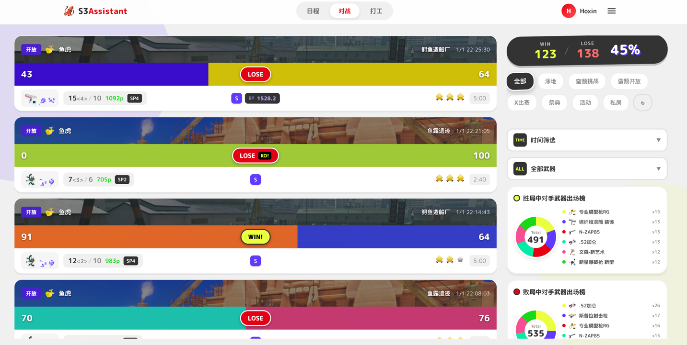
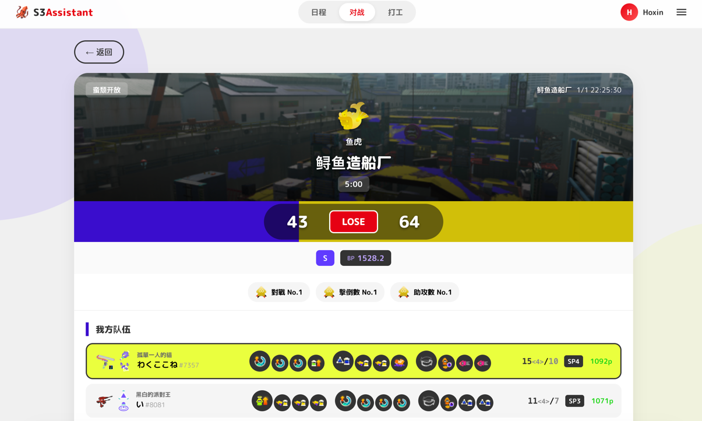
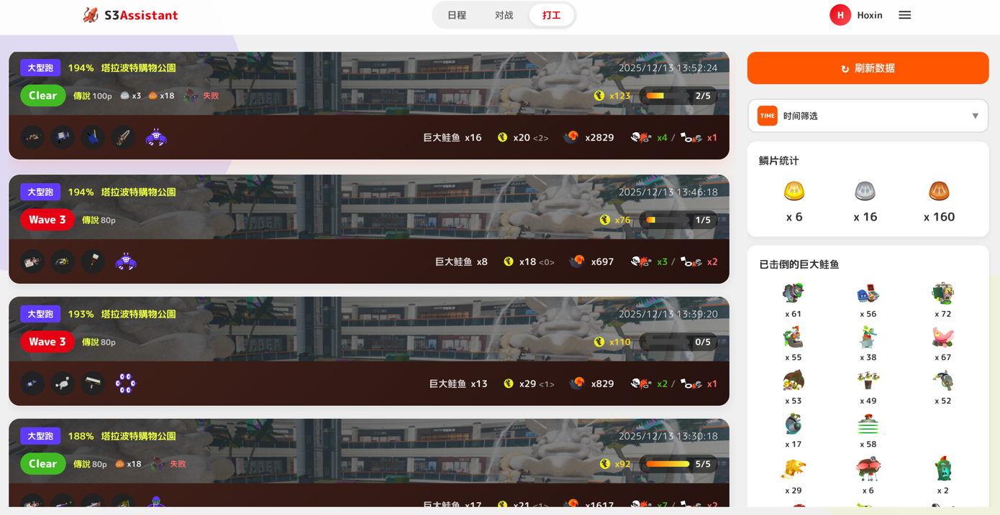
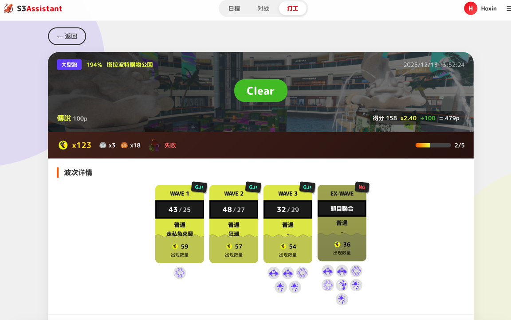
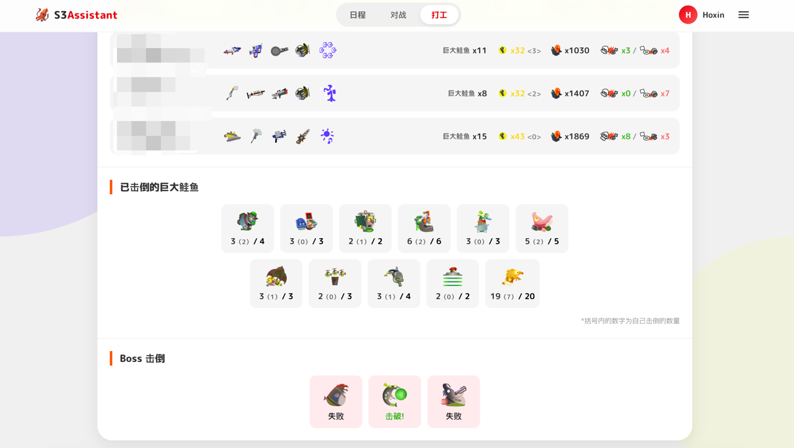
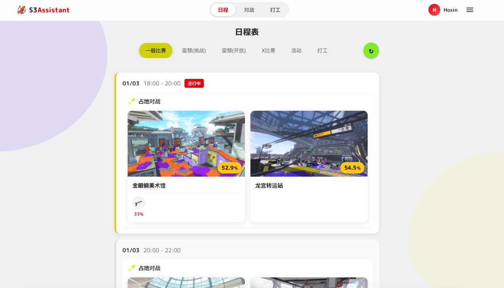

# Splatoon3 Assistant

> Splatoon3 游戏数据分析助手 - 通过 Nintendo Switch Online API 获取并分析游戏数据

**项目状态**: ✅ MVP 完成

---

## 功能特性

### 已完成

- **NSO 认证** - 完整的 Nintendo Switch Online 登录流程，Token 自动刷新
- **对战记录** - 查看历史对战详情、队伍数据、个人表现
- **打工记录** - Salmon Run 打工详情、波次信息、Boss 击杀统计
- **日程查询** - 当前/upcoming 对战和打工日程
- **数据备份** - 导出/导入个人数据，支持跨设备迁移
- **多平台支持** - Windows / macOS (Intel & ARM) 独立运行

### 开发中

- **AI 助手** - 接入大语言模型，提供个性化游戏建议和数据分析

---

## 页面预览

### 对战记录

<!-- 截图位置: 对战列表页面 -->


### 对战详情

<!-- 截图位置: 对战详情页面 -->


### 打工记录

<!-- 截图位置: 打工列表页面 -->


### 打工详情

<!-- 截图位置: 打工详情页面 -->



### 日程查询

<!-- 截图位置: 日程页面 -->


---

## 快速开始

### 下载运行

从 [Releases](https://github.com/KyanSAMA/splatoon3-assistant/releases) 下载对应平台的压缩包，解压后直接运行。

### 从源码运行

```bash
# 克隆项目
git clone https://github.com/your-repo/splatoon3-assistant.git
cd splatoon3-assistant

# 前端
cd frontend
npm install
npm run build

# 后端
cd ../backend
pip install -r requirements.txt
python run.py

# 访问 http://127.0.0.1:8000
```

---

## 项目结构

```
splatoon3-assistant/
├── backend/                    # 后端服务
│   ├── main.py                 # FastAPI 应用入口
│   ├── run.py                  # 打包启动入口
│   ├── build.spec              # PyInstaller 配置
│   ├── database/
│   │   └── migrations/         # 数据库迁移文件
│   └── src/
│       ├── api/                # SplatNet3 API 封装
│       ├── auth/               # NSO 认证模块
│       ├── core/               # 核心模块（配置、异常、迁移）
│       ├── dao/                # 数据访问层
│       ├── models/             # 业务模型
│       ├── services/           # 业务服务层
│       └── utils/              # 工具函数
├── frontend/                   # 前端应用 (Vue 3)
│   ├── src/
│   │   ├── api/                # API 调用封装
│   │   ├── components/         # 通用组件
│   │   ├── views/              # 页面视图
│   │   └── router/             # 路由配置
│   └── dist/                   # 构建产物
├── data/                       # 数据文件
│   ├── json/                   # 游戏数据 JSON
│   └── langs/                  # 多语言文件
└── .github/
    └── workflows/              # GitHub Actions CI/CD
```

---

## 技术栈

### 后端

| 技术 | 用途 |
|------|------|
| Python 3.11 | 运行环境 |
| FastAPI | Web 框架 |
| SQLAlchemy 2.0 | ORM (异步) |
| SQLite + aiosqlite | 数据库 |
| httpx | HTTP 客户端 |
| PyInstaller | 打包工具 |

### 前端

| 技术 | 用途 |
|------|------|
| Vue 3 | 前端框架 |
| Vue Router | 路由管理 |
| Vite | 构建工具 |

---

## 打包发布

### 手动打包

```bash
# 1. 构建前端
cd frontend
npm install
npm run build

# 2. 安装后端依赖
cd ../backend
pip install -r requirements.txt
pip install pyinstaller

# 3. 打包
pyinstaller build.spec --noconfirm

# 4. 产物位于 backend/dist/S3Assistant/
```

### GitHub Actions 自动打包

推送版本标签触发自动构建：

```bash
# 创建并推送标签
git tag v1.0.0
git push origin v1.0.0
```

构建完成后，Release 页面将自动发布以下产物：
- `S3Assistant-Windows.zip` - Windows 版本
- `S3Assistant-macOS-Intel.zip` - macOS Intel 版本
- `S3Assistant-macOS-ARM.zip` - macOS Apple Silicon 版本

手动触发构建（无 Release）：GitHub Actions → Build and Release → Run workflow

---

## 数据安全

- **本地存储** - 所有数据存储在本地 SQLite 数据库
- **Token 安全** - Session Token 加密存储，不上传任何服务器
- **备份加密** - 导出文件不包含敏感 Token 信息

---

## 开发路线

- [x] NSO 认证流程
- [x] 对战记录查询
- [x] 打工记录查询
- [x] 日程查询
- [x] 数据备份/恢复
- [x] 多平台打包
- [ ] AI 助手接入

---

## 许可证

本项目仅供学习和个人使用。

---

## 致谢

本项目的实现参考了以下开源项目：

- [splatoon3-nso](https://github.com/Cypas/splatoon3-nso) - NSO 认证流程和 GraphQL API 封装
- [splatoon3-schedule](https://github.com/Cypas/splatoon3-schedule) - 数据处理和项目架构参考
- [nxapi](https://github.com/samuelthomas2774/nxapi) - NSO API v4 加密支持
- [sendou.ink](https://github.com/sendou-ink/sendou.ink) - 武器数据解析
- [splat3](https://github.com/Leanny/splat3) - 游戏数据源

感谢 Splatoon3 开源社区的贡献！
